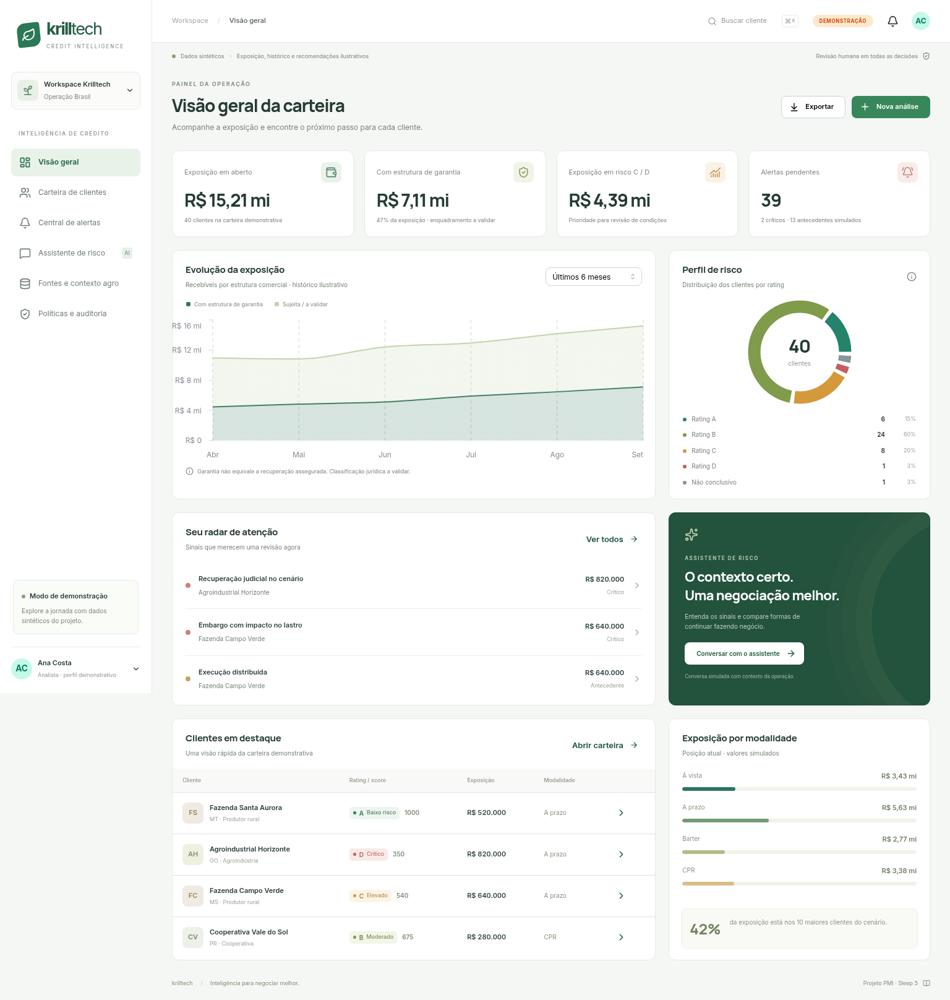

# Krilltech | Inteligência de crédito

Workspace de demonstração do projeto PMI Sleep 5: avaliar **cliente + operação**, explicar evidências e orientar modalidade, prazo e garantia com revisão humana.

## Executar o frontend

Requer Node.js 22.12+ e npm. Python 3 é necessário apenas para regenerar os dados e executar o teste de paridade com o agente.

```bash
cd frontend
npm ci
npm run dev -- --host 127.0.0.1
```

Abra http://127.0.0.1:5173. Dashboard e simulações funcionam localmente. Para o chat com o agente publicado, configure `backend/.env` conforme [backend/README.md](backend/README.md) e execute `npm run dev:api` em um segundo terminal dentro de `frontend`. A tela também oferece “Demonstração local”, sem IBM.

## O que está pronto

- Dashboard com exposição, distribuição de rating, evolução ilustrativa, modalidades e concentração.
- Carteira pesquisável, filtros, ordenação, paginação e exportação CSV.
- Nova análise com cliente/CNPJ, modalidade, valor, prazo, garantia e vínculo da área.
- Relatório com score, recomendações, fontes, simulação de modalidade e parecer registrado.
- Assistente com contexto da operação, conexão real ao watsonx Orchestrate live, histórico remoto e modo local opcional.
- Central de alertas com classificação, responsável demonstrativo e registro de tratamento.
- Explorador dos seis CSVs originais e gráficos agronômicos a partir do mock INMET.
- Políticas versionadas, comparação com o Python, sensibilidade e trilha local de auditoria.
- Layout responsivo, estados vazios e de carregamento, tratamento de erro e navegação por teclado.

**Limite da integração:** 40 clientes demonstrativos; seis arquivos com 1.000 registros cada. Exposição, garantias, grupos, notas por pilar, evolução e sinais antecedentes são sintéticos. O modo watsonx envia mensagens ao agente publicado; o modo local usa respostas programadas. O score lateral e o dashboard não são atualizados pelo parecer remoto. Persistência local usa localStorage; a ponte de desenvolvimento fica restrita a este computador e ainda não possui autenticação de usuários.



## Tecnologias

React + TypeScript + Vite, Mantine (componentes, formulários, modais e gráficos), Recharts, React Router, Lucide, PapaParse, Vitest e Playwright. Versões exatas estão no lockfile. Fontes são servidas localmente.

## Organização e integração

A [solução enviada pela equipe](docs/referencias/solucao.md) foi preservada como referência. O guia atualizado registra as divergências entre essa proposta, os dados disponíveis e o código.

| Caminho | Responsabilidade |
| --- | --- |
| `consultar_red_flags.py` | Ferramenta da equipe, com leitura adaptada aos CSVs normalizados |
| `*_normalizado.csv` | Arquivos originais, preservados |
| `frontend/src/pages` | Sete áreas do workspace |
| `frontend/src/domain` | Tipos e regras exclusivamente demonstrativas |
| `frontend/src/services/gateway.ts` | Adaptadores de demonstração e chat watsonx via backend |
| `backend/server.mjs` | Ponte local, autenticação IAM e execução do agente live |
| `frontend/src/services/store.tsx` | Estado e persistência locais |
| `frontend/scripts/prepare_data.py` | Preparação determinística dos dados e rastreabilidade |
| `docs/frontend-integracao.md` | Arquitetura, contrato proposto e pendências do backend |
| `docs/guia-desafio-atualizado.md` | Guia de negócio atualizado, incluindo limites da solução |
| `output/pdf/guia-desafio-atualizado.pdf` | Guia diagramado para leitura e compartilhamento |

**Atenção à versão da política:** `solucao.md` define pesos por pilar e cortes 800/600/400; o agente v4 usa multiplicadores logarítmicos e cortes 800/650/500. A interface explicita ambas. A política "Projeto v0.2" é uma simulação de implementação da proposta; não representa aprovação da Krilltech nem modelo calibrado. Em produção, score e permissões devem vir do backend.

## Verificar

```bash
cd frontend
npm run lint
npm run build
npm run test
python3 -m unittest discover -s ../tests -p 'test_*.py'
npx playwright install chromium
npm run test:e2e
```

Com Chromium já instalado no Linux, use `CHROMIUM_PATH=/usr/bin/chromium npm run test:e2e`. Os testes cobrem os snapshots de 160 combinações de cliente/modalidade contra o Python v4 sem importar o SDK IBM, regras críticas, cobertura insuficiente, fontes e jornadas em desktop/celular. Regeneração dos mocks: `npm run data:prepare`.

O build em `frontend/dist` pode ser servido como SPA com fallback para `index.html`. O servidor Vite e a ponte IBM são para desenvolvimento local. Um deploy web compartilhado requer backend autenticado, gestão de segredos e proxy `/api`; não exponha a ponte local diretamente à internet. O guia PDF registra o contexto de negócio anterior à conexão live; o estado técnico atual está no README do backend.
