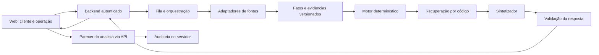

# Integração do workspace de risco

Versão 0.3 · 12/09/2026. Contrato **proposto para alinhamento** entre frontend, backend e agentes. A ponte local de chat já está implementada em `backend/server.mjs` (`GET /api/watsonx/status` e `POST /api/chat`). Os endpoints `/api/v1/*` abaixo continuam propostos.

## Limite entre a demonstração e o sistema

Hoje, React consome um JSON preparado dos CSVs e cenários sintéticos. `RiskGateway.analyze` e o chat de demonstração continuam locais. O modo watsonx usa `chatWithWatsonx`, que chama a ponte local e o agente live com ambiente e versão explícitos. A autenticação IAM fica no servidor e o histórico remoto usa o `thread_id` retornado pela IBM. O frontend calcula indicadores demonstrativos, interpreta políticas de exemplo e salva análises e pareceres no navegador; esses indicadores não são alterados pela conversa remota.

Conexão confirmada em 12/09/2026 com o agente `agente-sintetizador-risco`, live v2, atualizado às 12:13 GMT-3. A versão do deploy IBM é independente da versão v4 do arquivo Python. Configuração e limites estão em [backend/README.md](../backend/README.md).

Na integração, o servidor passa a ser a autoridade para fatos, score, recomendações, autorização e auditoria. O cliente envia a intenção de operação, renderiza o resultado recebido e permite revisão. Não aceitar score, rating ou identidade de analista informados pelo navegador como verdade.



O Orchestrate pode coordenar coleta, ferramentas de regras e geração de texto. O desenho final do serviço deve ser acordado com quem desenvolve os agentes; a web depende do contrato do backend, e não de detalhes do fornecedor. Agendamento de monitoramento e alertas é trabalho de servidor, não do navegador aberto.

## Módulos e dados de domínio

- **Cadastro:** cliente com identificador interno estável, identificadores fiscais tipados, aliases e vínculos verificados de grupo/imóvel.
- **Operação:** modalidade, valor, moeda, prazo, vencimento, produto/cultura/safra, contraparte, garantia e lastro. CPR física e financeira precisam virar opções distintas no contrato real; o mock usa `cpr` genérico.
- **Coleta:** fonte, status da consulta, data do evento, data de publicação, data de coleta, referência e validade. Diferenciar indisponível, sem cobertura e consulta concluída sem achado.
- **Análise:** snapshot imutável dos fatos, operação, versão da política e explicação. Uma alteração da operação cria nova versão.
- **Evidência:** código normalizado, status, abrangência, identificador de origem, vínculo com cliente/imóvel e texto bruto ou referência controlada.
- **Revisão:** recomendação anterior, decisão humana, justificativa, responsável autenticado, horário e versão analisada.
- **Carteira:** recebíveis em aberto e vencimentos do ERP; títulos e garantias relacionados sem dupla contagem.

## API sugerida

| Método e caminho | Responsabilidade |
| --- | --- |
| `GET /api/v1/clients?query=&rating=&cursor=` | Carteira autorizada com paginação no servidor |
| `GET /api/v1/portfolio/summary?asOf=` | Indicadores reconciliados, unidade e data-base |
| `POST /api/v1/analyses` | Validar operação, criar análise; 202 com id se assíncrona |
| `GET /api/v1/analyses/:id` | Estado queued/running/completed/partial/failed e relatório |
| `GET /api/v1/analyses/:id/evidence/:evidenceId` | Origem autorizada; evitar URL arbitrária fornecida pelo cliente |
| `POST /api/v1/analyses/:id/messages` | Conversa ancorada ao snapshot; resposta JSON inicialmente |
| `POST /api/v1/analyses/:id/reviews` | Parecer com justificativa e controle de versão |
| `GET /api/v1/alerts` | Fila deduplicada com tipo, prioridade e responsável |
| `PATCH /api/v1/alerts/:id` | Assumir ou tratar alerta, registrando motivo |
| `GET /api/v1/policies/:version` | Política publicada, regras e vigência |
| `GET /api/v1/audit?clientId=` | Eventos permitidos ao perfil autenticado |

Usar idempotency key na criação de análises e pareceres, versionamento/ETag nas revisões concorrentes e identificador de correlação nos erros. Valores monetários em centavos inteiros ou decimal explícito; datas ISO 8601 com fuso. Consultas demoradas usam job id e polling limitado; SSE pode ser adicionado depois com cancelamento e timeout. Não retentar automaticamente mutações sem idempotência.

## Exemplo de criação

```json
{
  "clientId": "cliente-interno-42",
  "identifier": {"type": "CNPJ", "value": "33444555000103"},
  "operation": {
    "modality": "barter",
    "amountMinor": 18000000,
    "currency": "BRL",
    "termDays": 120,
    "guaranteeType": "penhor",
    "collateralAreaId": "imovel-7"
  },
  "requestedPolicyVersion": "project-v02"
}
```

O cliente pode solicitar uma política de simulação, mas o servidor valida sua permissão e define a versão efetivamente aplicada. O vínculo do lastro deve ser demonstrado por evidência, não por checkbox como no mock.

## Forma recomendada de resposta

```json
{
  "id": "analise-42-v1",
  "status": "completed",
  "mode": "demo",
  "createdAt": "2026-09-12T12:00:00Z",
  "policyVersion": "project-v02",
  "dataSnapshotId": "snapshot-42",
  "assessment": {
    "baseScore": 540,
    "score": 399,
    "rating": "D",
    "confidence": "not_calibrated",
    "overrides": [{"code": "EMBARGO_LASTRO", "evidenceIds": ["ev-1"]}]
  },
  "evidence": [{
    "id": "ev-1",
    "code": "EMBARGO_LASTRO",
    "source": "fixture_controlada",
    "status": "confirmed_in_demo",
    "sourceRecordId": "pitch-ambiental",
    "eventDate": "2026-08-20",
    "publishedAt": null,
    "collectedAt": "2026-09-12T12:00:00Z",
    "isSynthetic": true
  }],
  "coverage": {
    "status": "partial",
    "missingSources": ["CENPROT", "DataJud", "ZARC_janela"]
  },
  "narrative": {
    "text": "No cenário, o lastro de barter está ligado à área embargada.",
    "evidenceIds": ["ev-1"],
    "knowledgeVersion": "kb-v2",
    "modelVersion": "mock-local"
  },
  "recommendations": [{
    "modality": "barter",
    "status": "requires_review",
    "reasonCode": "REVIEW_COLLATERAL",
    "evidenceIds": ["ev-1"]
  }],
  "requiresHumanReview": true
}
```

Este payload é um exemplo sintético, não a resposta atual do Python. A implementação real também deve devolver operação normalizada, decomposição por pilar, matriz completa, estado de cada fonte e versões das ferramentas. O mock TypeScript é mais enxuto: migrar seus tipos para o contrato acordado, validando a resposta em runtime antes de renderizar.

## Agente existente: divergências a resolver

1. `consultar_red_flags.py` recebe identificador, modalidade, finalidade e campos agronômicos opcionais, e retorna texto. Ainda não recebe valor, prazo, garantia ou lastro nem retorna evidências estruturadas. Evitar extrair o score de uma frase com regex; fornecer estrutura pelo adaptador Python.
2. O motor v4 do commit 23c2dab usa multiplicadores logarítmicos e faixas 800/650/500. `solucao.md` define pilares 30/20/20/15/15 e faixas 800/600/400. O frontend mantém ambas explicitamente. Escolher uma versão canônica antes de integrar.
3. O v4 já separa `INFRACAO_AMBIENTAL_SEM_EMBARGO` e `EMBARGO_AMBIENTAL` pela presença de `CD_TERMOS_EMBARGOS`, ignorando cancelados. Ainda é necessário confirmar vigência e vínculo do termo com o lastro; a coluna, isoladamente, não faz essa verificação.
4. A presença no CSV PGFN não substitui a interpretação de situação, suspensão, negociação e atualização do débito. O v4 já usa situação, ajuizamento, entidade e relevância rural; os multiplicadores ainda são julgamento de especialista.
5. Os quatro CNPJs de apresentação são fixtures no Python; RJ vem desse roteiro, não de uma consulta processual.
6. A leitura Python foi adaptada aos arquivos normalizados de `origin/main` (dados d139da3 e motor 23c2dab), usa `CNPJ_NORMALIZADO` e preserva letras no identificador. Linhas sem CNPJ normalizado são ignoradas, sem reconstruir CPF mascarado. Validar existência e dígitos verificadores no futuro backend.
7. O repositório não comprova execução do fluxo completo ou implantação do Sintetizador. Validar isso com a equipe responsável e com evidência de execução.

## Escopo dos snapshots v4 e pendências de domínio

`prepare_data.py` carrega as funções reais do Python, removendo apenas o import/decorador de registro IBM, e produz resultados para 40 clientes × 4 modalidades. A finalidade é sempre `producao`; campos agro não são enviados. O JSON preserva o hash do código-fonte. O frontend usa esses resultados em `agent-v04`, sem reimplementar a fórmula ou chamar o agente. A política padrão da demonstração permanece `project-v02`, explicitamente identificada, até a equipe alinhar documento e motor.

O v4 distingue multa de termo de embargo e usa cultivares do SISZARC. Ainda há pontos para a equipe revisar: `_avaliar_anomalia_inmet` exige apenas cinco linhas horárias, embora o comentário descreva cinco dias; a falta de cultivar em uma chave coberta retorna `cultivar_nao_indicado`; repetição de dívida por CNPJ mantém a última linha. Não ativar inferência agronômica na interface antes de resolver cobertura, janela, representatividade da estação e tratamento de dados faltantes. A recomendação jurídica também exige validação própria, independentemente do cálculo determinístico.

## Requisitos para ligar o backend

- Autenticar no servidor; separar perfis de comercial, crédito, jurídico e administrador; aplicar escopo da carteira em cada endpoint. O avatar demonstrativo não implementa papéis.
- Guardar credenciais IBM e de fontes em serviço de segredos no backend. Variáveis `VITE_*` são públicas no build e não podem conter tokens secretos.
- Remover `demo.json`, CSVs públicos e cálculos locais da jornada de produção; expor apenas os dados autorizados. A réplica do motor permanece como fixture de teste, nunca fonte de autorização.
- Validar correspondência de evidência e afirmação, impedir números novos na narrativa e preservar resultado determinístico em caso de falha do LLM. RAG por chave reduz ambiguidade de busca, mas não garante fonte correta nem ausência de alucinação.
- Tratar a mensagem e documentos consultados como dados. O agente não pode obter ferramentas ou permissões adicionais por instruções embutidas em uma fonte.
- Registrar auditoria durável no servidor, com acesso controlado. O localStorage pode ser apagado ou adulterado e não é trilha regulatória.
- Definir retenção, base legal e revisão de dados pessoais com responsáveis da empresa; autorização para consulta e disponibilidade técnica são controles distintos.
- Medir latência de coleta e geração separadamente, custo por operação, cobertura, frescor e taxa de falha por fonte. Não reportar sistema saudável quando a consulta falhou e voltou vazia.

## Sequência de integração sugerida

**1. Contrato e fixtures:** alinhar política, códigos, identificadores e payloads com os agentes; transformar casos fixos em testes compartilhados.

**2. Backend mínimo:** endpoints de análise e conversa com resposta estruturada e evidência; substituir o gateway e a leitura direta de dados nas páginas. Em produção, matriz de recomendação e score vêm do servidor.

**3. Carteira e workflow:** ERP, análises versionadas, estados de job, revisão autenticada e alertas persistidos. Não sobrescrever análise anterior ao trocar modalidade.

**4. Fontes reais:** uma fonte por vez, com termos de acesso validados, situações normalizadas, timestamps, cobertura e testes de indisponibilidade.

**5. Modo sombra:** confrontar relatórios com analistas sem modificar condições comerciais automaticamente. Só ampliar uso após critérios de qualidade e negócio definidos com a Krilltech.
